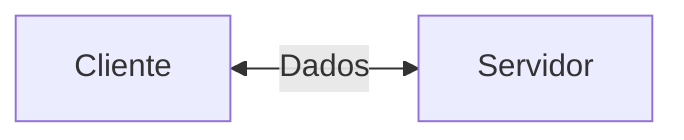
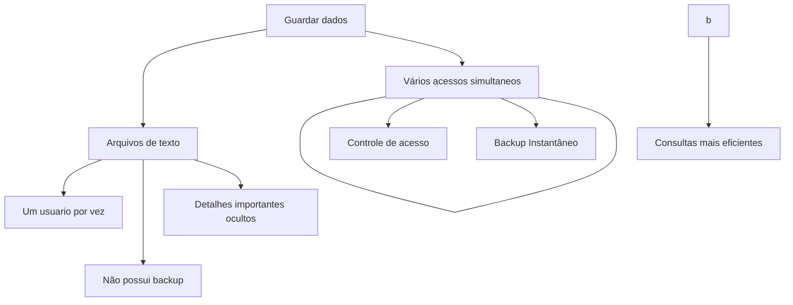
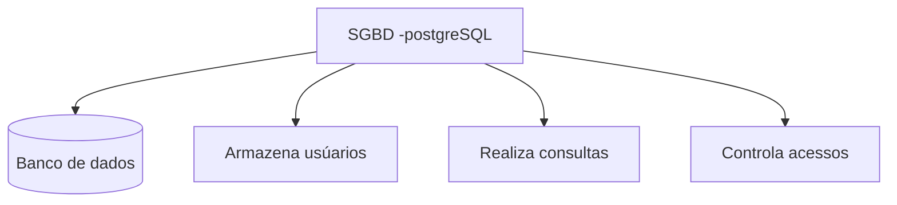

## Servidor de desenvolvimento
Será uma interface de desenvolvimento,utilizada para projetar aplicações e banco de dados


---
## Servidor de Arquivos Educacional
É um servidor para armazenar arquivos e facilitar na hora da transferência.

>O endereço para acesso ao srvidor de arquivos é:
`\\10.87.36.10`

>credênciais de acesso:
 E-mail: aluno,
 Senha: aluno`

---
## Servidor Pessoal
    O moba será a interface para acesso ao meu servidor de desenvolvimento
>O acesso será realizado via SSH
>credenciais de acesso: `Username: root e Porta:`2222`
----

### Importante 
`Id da minha maquina turma 02: 192.168.10.103       `

Para alterar a senha, utilizamos o comando 

```bash 
passwod
```


---
Para visualizar quais serviços estão rodando no computador(servidor) utilizamos o comando :

```bash
htop
````
---
|Recursos|Configuração|
|----|------|
Processador 2 cores|
|RAM|
|Armazenamento|
6 GB|
|Sistema Operacional|
Ubuntu 26.04 LTS

A utiçização de um servidor de desenvolvimento, simula um ambiente real de produção.
Os objetos esperados são:

-Deploy de projetos,
Aplicação de banco de dados,
-Experiência real de mercado

## Banco de dados
Antigamente os dados eram salvos em arquivos/planilhas.



---
>Mas afinal aonde entra o banco de dados em aplicações Web? >🤔
```mermaid
graph LR
A[Usuário]-->
B[Aplicação WEB]
-->C[(Banco de Dados)]

## SGBD
Sistema de Gerenciador de Banco de Dados

>Função:Gerenciar controlar e permitir consultas nos nossos bancos de dados
```


## SGBD
Sistema de Gerenciador de Banco de Dados

>Função:Gerenciar controlar e permitir consultas nos nossos bancos de dados

