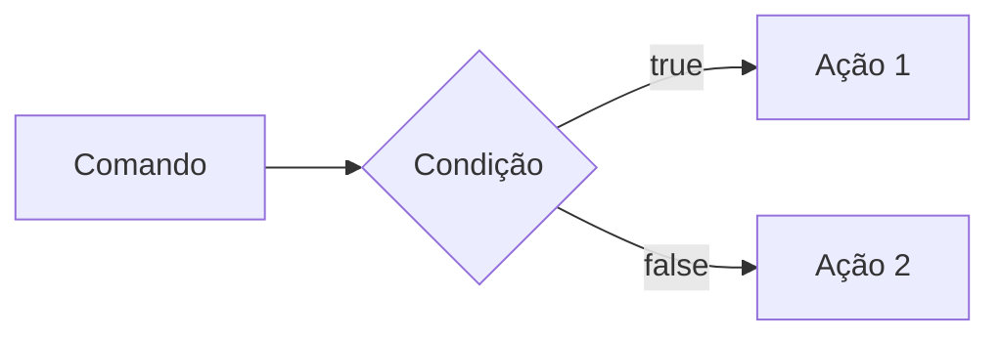
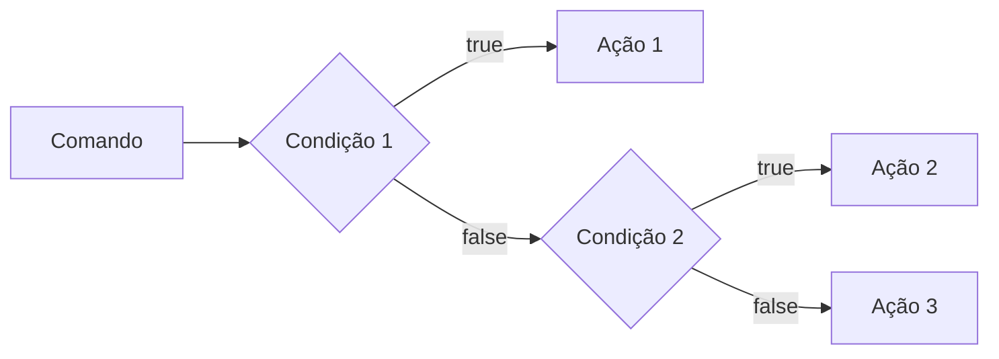
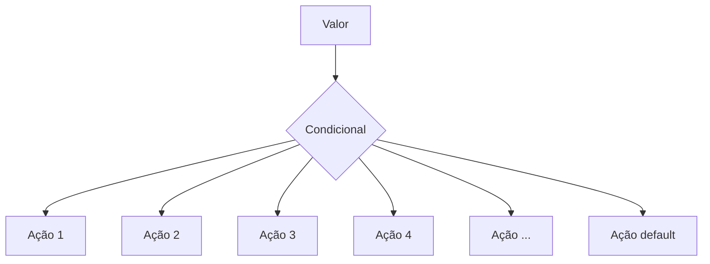
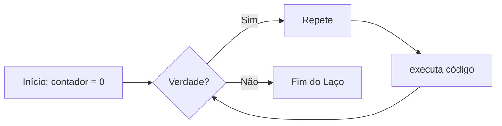
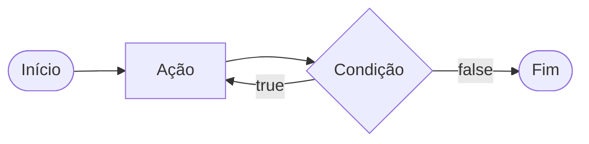
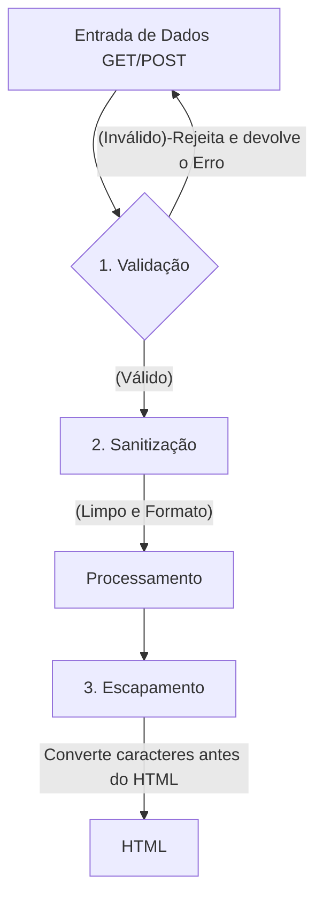
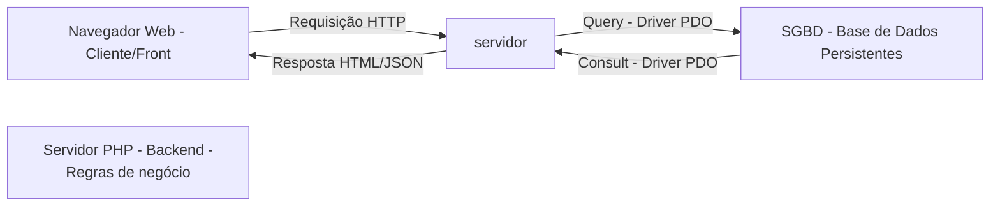
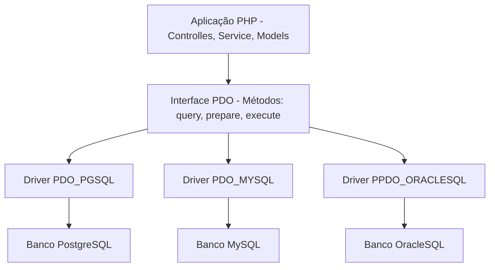

# Curso Backend - 225h - Tecnico em  
Sistemas - Senai

Profº Diogo TB

Escola SENAI Americana 
2º Semestre 2026

Aluna: Sofia Cristina

## Objetivos do curso

-Desenvolver aplicações Web Server Side, Utilizando a linguagem PHP:
- Aplicar Sisntaxe Nativa PP(Vanilla):
- Manipulação HTTP:
- Persistencia de dados:
- Segurança conta SQL Injection /CRSF;
- Refatoração em POO ( Programação Orientada ao Objeto);
- Arquitetura MVC (Model, View , Controller);
- Utilizaçãop do Framework Larevel;

# Observação 
Frameork - É um conjunto de Bibliotecas que oferecem uma solução completa para o desenvolvimento de alguma coisa

# Cronograma do Semestre 

Carga horária: 105h 1º Semestre e 120h 2º Semestre

Duração:  20 Semanas 1º Semestre e 20 Semanas 2º Semestre

### Semana 1: Introdução ao BackEnd e Configuração do Ambiente PHP

# O que é BackEnd ?
 - O backend é a parte de um sistema ou site que fica nos bastidores. 
 Ele cuida do servidor, do banco de dados e da lógica do sistema, processando as informações que o usuário não vê diretamente.
 
# Como o Backend Funciona 
  - Servidor: O computador central que recebe o que você pede na tela e envia a resposta de volta.
  - Banco de dados: Onde ficam guardadas as informações, como senhas, nomes de usuários e produtos.
  - Regras de negócio: A lógica que faz o sistema funcionar, como calcular o frete de uma compra ou conferir se a senha está certa.
 
 # Principais Tecnologias Linguagens de programação: 
 Ferramentas usadas para escrever o código do servidor, como Python, Node.js (JavaScript), Java e PHP.APIs: Os "caminhos" que permitem que o que você vê no celular converse com o servidor.

 # Sobre o mercado atual:
  o cenário é bom, mas mais exigente do que era. Quem conhece só o básico enfrenta mais concorrência. Quem alia backend sólido com IA aplicada, cloud e inglês está num patamar completamente diferente — vagas internacionais remotas são uma realidade pra esse perfil.

  # Para que serve
-Processar lógica de negócio: regras, cálculos, validações (ex: calcular frete, aplicar desconto, validar login)

-Gerenciar banco de dados: salvar, buscar, atualizar e deletar informações

-Autenticação e autorização: controlar quem pode acessar o quê (login, senhas, permissões)

-Fornecer APIs: criar "pontes" (endpoints) para o frontend ou outros sistemas consumirem dados

-Integração com serviços externos: pagamentos, e-mails, notificações, APIs de terceiros

-Segurança: proteger dados sensíveis, evitar ataques (SQL injection, XSS, etc.)

-Escalabilidade e performance: garantir que o sistema aguente muitos usuários ao mesmo tempo.

Fintechs e Bancos
Segurança, transações, alta escala 

E-commerce
Catálogo, pedidos, pagamentos

Healthtechs
Prontuários, telemedicina

SaaS / Startups
Backend é o coração do produto

Logística
Rastreio, rotas, tempo real

Educação
Plataformas, conteúdo, usuários

## O ciclo de vida da Requisisão http

#### O que é HTTTP ?

* HTTP*, Hyptext Trasnfer Ptotocol é um protocolo de comunicação utilizado para tranfrência de informação na www ( World Wide Web ) e em outas redes.

O HHTP é a base para que o cliente e um servidor web troquem insformações.Ele permite a requisição e a resposta de recursos como imagens, arquivos e textos 

### marmaid = Diagrama 
fica lindo alias 

---
### Aula 02 De Backend

## O que é Backednd
Backend é a interface entre o servidor e o usúario. Uma resposta para uma requisição.

#### Como funciona na prática o Backend ?

- ***Ação do usúario**: Envia uma solicitação pela UI(Inteface do Usuário). Exemplo de UI: Tela do celular, Navegador da Internet,Alexa. Gemini,IOT ...
- **Enviar uma requisição**: A UI Transforma a ação do usuário em uma requisição HTTP.
-**Processamento pelo Backend**: O código backend recebe o pedido valida os dados e decide o que fazer.Exemplo:Consultar uma informação no BD(A base de dados).
- **Resposta**: O servidor devolve o resultado para a UI. Exemplo: Um login autorizado, a confirmação de uma compra...
-----

### Tipos de Requisições HTTP:

Os tipos de requisições HTTP indicam a açãoque o usuário deseja executar no servidor. As principais ações são:
 
 - **GET**: Pede dados de um luhgar específico do servidor. "Não faz alterações no servidor"
 - ** DELETE**: Apaga um dado do servidor.
 - **post**: eLA ENVIA DADOS NOVOS PARA *criar* algo ou processar insformações no servidor.
 - **PUT/PATCH**: Modificar um dado já existente.

 >Obs: Diferença entre os comando : (Put) faz uma alteração completa já o PATCH faz uma alteração parcial.
----

### Iniciando o PHP

**PHP** (hyperTxt PreProcessor) é uma linguagem de programação interpretada e open source,focada no desenvolvimento de sistemas para web,pode ser usada junto com o HTML para criaçõa de páginas web dinâmicas.

O PHP de fato é uma das linguagens de programação mais populares da  atualidade. Ela permite que você crie aplicações web robustas, de uma muito simplificada e direta. A linguagem tem diversos recursos que facilitam e aceleram o processo de desenvolvimento de sites e sistemas para web. E além do mais, ela ainda tem um otímo ecosistema, uma excelente comunidade e um grande mercado de trabalho.

-----

##### Instalando o PHP

- Fazer o Dowload do php em (php.net)
- Zip - NTS(Non Thread Safe) 8.5
- Descompactar o arquivo do PHP na pasta C:\src\php (Para descompactar usar o 7zip + melhor ) => Nunca salvar arquivos ou programas na raiz do sistema(C:)
- Adicionar a Pasta do PHP(c:\src\php) As varaiáveis de ambiente do Sistema (PATH)
- Verificar a instalação com o comando *php--version*

----
### Aula do dia 07.08
#### Criando minha primeira Aplicação em PHP 

1. Antes de começar a codar:

- Prepara meu VS Code 
  - Criar um Profile próprio para o PHP
  - Instalar as extensões necessárias para transformar o VS Code em uma IDE
      - PHP Intelephense => Permite a utilização de snippets(atalhos de codígo)
      - PHP Debug => ajuda a encontrar erros de código
      - PHP Cs Fixer =>  formatação de códigos (Identação)
      - PHP Server => ajuda na criação de um servidor local para PHP
- Desabilitamos o PHP Nativo do VsCode ( @builtin PPHP)
    
2. Hello.World (muito importante)
 
 ### Semana 2 - Variáveis, Constantes e Operadores em PHP
 #### Estudo de Variáveis e constantes em PHP 
 Declarar variáveis é alocar um espaço na memoria que permite a inclusão e manipulação de dados 

 **Variáveis**

 - Devem ser declaradas usando "$" antes do nome da variável
 - São não tipadas ou seja não precisa declarar o tipo dela na criação .
 - Podem ser String, Numericas (Interger e Float), Bollenas e Nulas. Não permite declaração de Underfined
 - Usar o "declare(Strict_types+1)" na primeira linha do arquivo => blinda o sistema contra o conflito de tipos de variáveis.

 ###Constantes###

  - Não podem ser mudadas ou redeclaradas após a criação.
  - Podem ser criadas usando o "const" ou o "define"
  - Não permite interpolação 

  >concatenação = texto +texto( jeito errado)
  exemplo: 10 + 10 = 1010

  ## Estudo de Operadores" 
 
  **Aritméticos**: São usados para realizar Cálculos
  
  |Operador | Nome | Exemplo | Resultado |
  | - | - | - | - |
  | + | Adição | 10+5 | 15 |
  | - | Subtração | 10-5 | 5 |
  | * | Multiplicação | 10*5 | 50 |
  | / | Divisão | 10/5 | 2 |
  | % | Modulo(Resto) | 10%3 | 1 (10 div 3 da 3, sobra 1 ) |
  | ** | Expoente 2**3 | 8(2 elevado a 3) |

  obs: O operador % é o melhor amigo de um programador, permite ordenar listas e organizar fila e pilhas.

 **Relacionais**: Permite o Relacionamento entre dois valores, o resultado e uma operação é sempre uma boleana (verdadeira ou falsa). 

 | Operador | Significado | Exemplo | Resultado |
 | - | - | - | - |
 | > | Maior que | 18 > 18 | False |
 | >= | Maior ou igual que | 18 >= 18 | True |
 | < | Menor que | 10 < 20 | True |
 | <= | Menor ou igual á | 10 <=5 | False |
 | == | Comparação de valor | "10" == 10 | true |
 | === | Comparação Estrita | "10" ===10 | False |
 | != | Diferente | "10" !=10 | false
 | !== | Estritamente Diferente | "10"!==10 | True |

**Logícos**: Permite a Combinação entre sentença. 

- Operador AND (E) => && : Para o resultado ser o verdadeiro, todas as combinações precisam ser verdadeiras.
     - True && True => True 
     - True && False => False

- Operador OR (OU) => : Para o resultado ser o verdadeiro, basta apenas uma digitação ser verdadeira. 
    -  False || True => True
    - False || False => False

- Operador NOT (Não) => ! : Inverte a lógica da Operação 
    -!True => False
    - !false => true
   
    ---

    ### Aula do dia 12.08
    ### Semana 3 - Estrutura de Controle de Dados (condicionais e repetição)

 - **Conteúdo**: Estrutura `if`, `else`, `elseif`, operadores ternários, `match` => substituto do `switch/case`, loops `for`, `while`, `do-while` e `foreach`

 #### Estruturas de controlde de dados ajudam no processo de Automatização em Programas de Sistemas

 ##### Condicionais (IF, ELSE, ELSEIF)

 **Formas de uso**

 - Uso do 'If" apenas:
 Exemplo: Aplicar desconto de 10% em compras acima de 100 Reais;

 ```mermaid

 graph LR

    A[Comando] --> B{Condição} -->C[Ação]

```

```php

if($valorCompra > 100){
 $valorFinal = $valorCompra * 0.9;
}

```
- Uso do `if`e do  `else`
Exemplo: Aplicar um desconto de 10% para compras acima de 100reais e 5% para as demais compras



```php

if($valorCompra > 100){
    $valorFinal = $valorCompra * 0.9;
} else {
    $valorFinal = $valorCompra * 0.95;
}

```

## Aula do dia 14.08
- Uso do `elseif` (If Encadeado) => estrutura usada para manipulação de dados em duas ou mais condicionais.
Exemplo:Compras acima de 200 reias tem 15%de desconto, compras acima de 100 reias tem 10% de desconto e demais compras tem 5% desconto.



```php

if($valorCompra > 200 {
    $valorFinal = $valorCompra * 0.85;
} elseif($valorCompra > 100) {
    $valorFinal = $valorCompra * 0.9;
} else {
    $valorFinal = $valorCompra * 0.95;
}

```

*obs*: sempre usar `elseif` para situações que precisam de mais de uma condição, ou seja,fazer encadeamnto das condições.

- Uso *ERRADO* do if

```php 

if($valorCompra > 200) {
    $valorFinal = $valorCompra * 0.85;
}
if($valorCompra > 100) {
    $valorFinal = $valorCompra * 0.9;
} else {
    $valorFinal = $valorCompra * 0.95;
}

```
---

>Ele significa basicamente: "Se a primeira condição não for verdadeira, verifique esta outra condição."

>Pense nele como:
SE isso acontecer → faça isso
SENÃO SE aquilo acontecer → faça aquilo
SENÃO → faça outra coisa.

#### Operadores ternários 

Um atalho para a estrutura condicional `if/else, normalmente escrito em uma uníca linha de código.

` condição ? verdadeira : falsa ` 

Perfeito para a decisões curtas de uma linha de comando.

Exemplo: Verficar se a pessoa é maior de idade (18)

```php

$idade = 10;
//O fomrato é (condição) ? Verdadeiro : Falso;

$status = ($iddae>=18) ? "Maior de idade" : "menor de idade";
$status2 = ($idade>=60) ? "Idoso" : ($idade>=18) ? "Adulto" : "Criança" ;
'

echo $status //

```

#### Expressão Condicional `match` (PHP 8)

No mercado atual de PHP, não se uma mais uma `Switch/Case` para chegar valores fixos, usa-se o `match`. Ele compara um valor e retoran diretamente o resultado caso atenda a condição.



>Usamos o `graph TD` quando queremos fazer um gráfico de cima pra baixo. Igual mapa mental

#### Exemplo de aplicação: 
Selecionar o dia da semana a partir de um Nº

```php

$diaSemanaNum = date("W"); // pega o Dia da Semana em formato numérico

$nomeDiaSemana = match($diaSemanaNu) {
    "0" => "Domingo",
    "1" => "Segunda",
    "2" => "Terça",
    "3" => "Quarta",
    "4" => "Quinta",
    "5" => "Sexta",
    "6" => "Sábado",
    "default" => "Dia Inválido"
};

echo " Hoje é : $nomeDiaSemana";

```
---

##### Laços de Repetição

Um laço de repetição faz com que um bloco de código rode várias vezes até que uma condição mande parar. 

- O Laço while (Enquanto)

Ele verifica se a condição é verdadeira ANTES de entrar no laço. Ideal quando você não sabe exatamente quantas vezes vai rodar o laço. 


Exemplo de Aplicação do While:  jogo de Adivinhação de um nº Secreto

```php

$numeroSecreto = rand(1,10);

$tentativas = 0;

$numeroEscolhido = 0;

while(numeroEscolhido != numeroSecreto){
    echo "tente novamente"
    //Vou escolher outro Nº para adivinhar
    numeroEscolhido = rand(1,10);
    tentativas++;
}
echo 'Acertou parabéns!!!! O nosso nº secreto é "$numeroEscolhido';

```
- O Laço `do-while` (Faça- Enquanto)

A diferença é que ele executa o bloco pelo menos uma vez, mesmo que a conduição seja false desde o início, pois ele só pergunta no final.



Exemplo: Jogo de Adivinhação de um nº

```php

$numeroSecreto = rand(1,10);

do{
    $numeroEscolhido = rand(1,10);

    if(numeroEscolhido == numeroSecreto){
        echo "Parabens, acertou !!!";
        break
    }
    echo "Tente Novamente!!!";
}while(numeroEscolhido != numeroSecreto);
```

#### O freio de Emergência: `break` e `continue`

As vezes precisamos interferir no laço enquanto ele está rodando

As vezes precisamoso interferir no laço enquanto ele está rodando 

- `break`=> **Para Tudo!** Quebra o laço interiro e avai embora
- `continue` => **Pula a rodada!** Ele ignora o código daquela rodada especifica e pula logo par a próxima repetição.

Exemplo de Aplicação do Código: Sistema de Controle do Elevador

```php 

for($andar = 1 ; $andar<=10; $andar++){
    if($andar ==4){
        echo "Andar $andar está em obras. Passando direto!";
        continue;
    }

    echo "Elevador parou no andar $andar"
}

```
---
### Aula do dia 19/08 ###
##### Laço de Repetição `for`

Use o `for`quando você sabe quantas vezes precisa repetir uma ação ou quando precisa controle um contador. Ele possui três partes:

- inicialização,
- condição,
- incremento;

for(inicialização; condição; incremento){
    Ação
}

```mermaid

flowchart LR
    A[Início: i=0] --> B{i<10?}
    B --true--> C[Ação]
    D --> D[i++]
    B --> B
    B --false--> E[Fim]

```php
for($mes=1; $mes<=12; $mes++){
    echo "Mês $mes";
}

```

Nesse Exemplo, `$mes`começa em 1, o laço continua enquantio `$mes`for menor ou igual a 12 e, ao final de cada repetição, `$mes++`aumenta o contador em 1.

##### Laço de Repetição `foreach`

Use o `foreach` quando precisar percorrer cada item de um **array*. Ele acessa os elementos diretamente, sem que você precise controlar o contador.

Exemplo: Imprimir todos os itens de um vetor

```php

$frutas =["Maça", "Banana", "Uva", "Pera"];

foreach($frutas as $fruta){
    echo "fruta: $fruta";
}

Outro Exemplo: Acessar a chave e o valor de cada item:

```php 

$precos = [
    "Caderno" => 25.90,
    "Caneta" => 5.50,
    "Mochila" => 99.00
]; // vetor não ordenado chave => valor

foreach ($precos as $produto => $preco){
    echo "$produto: R$ number_format($preço,2)";
}
```

---
---
#### Desafio : Simulador de Cobrança (FINANÇASENAI) 
---

### AULA DO DIA 21.08 ###
### SEMANA 4 - Modularização com funções ###
#### Principio do DRY ( `Don´t Repeat) Yourself`) 

Se uma lógica foi escrita duas vezes ou mais dentro de um código, essa lógica deve virar uma função.

#### Funções Nativas do PHP

O PHPH tem milhares de funções prontas, essa funç~eos são chamadas de nativas.

- **O que é uma função?**

Uma função é como uma maquina:Você coloca uma matéria prima (que seria nosso paramêtro), ela processa e devolve um produto final(Retorno)

Exemplo de uma função Nativa:

```php

$texto= "senai americana";

//str_replace(ela busca um pedaço do texto e substitui por outro)
$textoNovo = str_replace("americana","São Paulo",$texto)
//Modificação = mudança(reescrita) (oq muda, para que ? aonde ?)

//strtouupper
echo strtoupper($textoNovo); // SENAI SÃO PAULO

```

#### Principais funções Nativas (mais utilizadas)

As funções abaixo já fazem parte do PHP e podem ser chamadas diretamente no código. Observe os parâmetros que cada uma recebe e o tipo de informação que ela retorna.

| Função | Categoria | O que faz | Como usar |
|---|---|---|---|
| `strlen()` | Strings | Retorna a quantidade de caracteres de um texto. | `$tamanho = strlen($texto);` |
| `strtoupper()` | Strings | Converte o texto para letras maiúsculas. | `$resultado = strtoupper($texto);` |
| `strtolower()` | Strings | Converte o texto para letras minúsculas. | `$resultado = strtolower($texto);` |
| `ucfirst()` | Strings | Converte a primeira letra do texto para maiúscula. | `$resultado = ucfirst($texto);` |
| `trim()` | Strings | Remove espaços e quebras de linha no início e no fim do texto. | `$limpo = trim($texto);` |
| `str_replace()` | Strings | Substitui uma parte do texto por outra. | `$novo = str_replace("-", "", $cpf);` |
| `substr()` | Strings | Extrai uma parte do texto a partir de uma posição. | `$inicio = substr($texto, 0, 3);` |
| `explode()` | Strings | Divide um texto e cria um array usando um separador. | `$palavras = explode(" ", $nome);` |
| `implode()` | Arrays | Junta os itens de um array em um único texto. | `$lista = implode(", ", $nomes);` |
| `count()` | Arrays | Conta a quantidade de itens de um array. | `$total = count($produtos);` |
| `in_array()` | Arrays | Verifica se um valor existe dentro de um array. | `$existe = in_array("SP", $estados, true);` |
| `array_push()` | Arrays | Adiciona um ou mais itens ao final de um array. | `array_push($nomes, "Ana");` |
| `array_pop()` | Arrays | Remove e retorna o último item de um array. | `$ultimo = array_pop($nomes);` |
| `sort()` | Arrays | Ordena um array em ordem crescente e reorganiza suas chaves. | `sort($notas);` |
| `array_keys()` | Arrays | Retorna um array contendo as chaves de outro array. | `$chaves = array_keys($produtos);` |
| `number_format()` | Números | Formata um número com casas decimais e separadores definidos. | `$preco = number_format($valor, 2, ',', '.');` |
| `round()` | Números | Arredonda um número para a quantidade de casas informada. | `$media = round($nota, 2);` |
| `max()` | Números | Retorna o maior valor de uma lista ou array. | `$maior = max($notas);` |
| `min()` | Números | Retorna o menor valor de uma lista ou array. | `$menor = min($notas);` |
| `is_numeric()` | Validação | Verifica se o valor é um número ou uma string numérica. | `if (is_numeric($entrada)) { ... }` |
| `isset()` | Validação | Verifica se uma variável existe e não possui valor `null`. | `if (isset($usuario)) { ... }` |
| `empty()` | Validação | Verifica se uma variável está vazia. | `if (empty($pedido)) { ... }` |
| `date()` | Data e hora | Formata uma data ou hora conforme uma máscara. | `$hoje = date('d/m/Y');` |
| `file_exists()` | Arquivos | Verifica se um arquivo ou diretório existe. | `if (file_exists('dados.txt')) { ... }` |
| `file_get_contents()` | Arquivos | Lê todo o conteúdo de um arquivo ou endereço. | `$conteudo = file_get_contents('dados.txt');` |
| `file_put_contents()` | Arquivos | Grava conteúdo em um arquivo, criando-o se necessário. | `file_put_contents('log.txt', $mensagem);` |

**Atenção:** algumas funções modificam o array original, como `sort()`, `array_push()` e `array_pop()`. Já outras retornam um novo valor, como `count()`, `explode()` e `str_replace()`. Em caso de dúvida, consulte a documentação oficial do PHP e verifique o retorno da função.

##### Documentação PHP

[Acesse a documentação oficial do PHP em português](https://www.php.net/manual/pt_BR/)

Consulte também a [referência de funções do PHP](https://www.php.net/manual/pt_BR/funcref.php) para pesquisar a sintaxe, os parâmetros eos valores por cada função.


#### Funções Customizadas (Criando suas próprias máquinas)

Quando o PHP não tem a função que queremos, nós a criamos!

**A Regra de Ouro:** Uma função deve focar em `return`(retornar um valor), e não imprimir (`echo`). 

Veja a diferença nesse exemplo:
```php

function calcularTotal($preco, $quantidade){
    //a função calcula e rotna o resultado, mas não imprime nada
    return $preco * $quantidade;
}

$total = calcularTotal(25.00, 3);

echo "Total da compra: R$ " . number_format($total, 2, ",", ".");
// Total da compra: R$ 75,00

```
A função `calcularTotal()` pode ser reutilizado em uma página, relátprio ou teste. O `echo` aparece somente fora da função, no momento de apresentar ao usuário.

#### Padrão de uso Corporativo (PHP & Strct Types)

No mercadpo de trabalaho, exigimos que a função avise exatamente o *tipo* de dado que ele espera receber e o **TIPO** que ela vai devolver.

Isso é chamado de **tipagem de funções**. Ao decalarar os tipos, o código fica mais fácil de entender e o PHP consegue indentificar erros antes que eles causem problemas maiores no sistema.

Os tipos mais usados/;

* `int`: Número inteiro `10`ou `1024`
* `float`: Número decimal ou ponto flutuante, `10,50`.
* `string`:Texto, como `Maria`
* `boll`: Valor lógico, `true` ou `false`.
* `void`: Identifica que a função não devolve nenhum valor.

O tipo deve ser escrito antes do nome de cada parâmetro e o tipo da função deve ser escrito após os parênteses precedito por `:`, informando o que a função vai devolver.

Exemplo de uso:

```php
function apresentarProduto(string $nome, float $preco): string{
    return "$nome custa R$ $preco";
}

$mensagem = apresentaproduto("Caderno", 25.90);
echo $mensagem;
//  Caderno custa R$ 25.90

```

>**Resumo**: Os tipos dos parâmetros documentam as entradas da função , o tipo após `;` documenta a saída da função.

##### O tipo Mágico: `void`

Se uma função faz um trabalho interno e **não retorna NADA** , dizemos que o retorno dela é "vazio" ou seja (`void`).

Exemplo função sem retorno:

```php
function registroLog(string $mensagwem): void{
    //apenas salvar em um arquivo de texto, não devolve nenhuma variável
    file_put_contentes("erro.log",$mensagem);
}

```

### Escopo e Referência (O segredo da memória)

#### O que é Escopo ? (A regra de Las Vegas)

* O que acontece dentro da função, fica dentro da função*. Uma variável criada fora não existe lá dentro, e uma craida lá dentro morre quando a função acaba.

**Escopo** é o local do personagem onde a váriavel pode ser armazenada/acessada. Em PHP, uma variável criada fora de uma função permanece ao **escopo global**. Uma variável criada dentro de uma função pertence ao **escopo local**.

Exemplo de Escopo de variável:´

```php
$comeSistema = "CRM Senai/"; //Variável global
function criarMensagenm():string{
    $mensagem ="Bem-Vindo!"; //Variável local
    return $menasgem;
}

echo $nomeSistema; //Correto: está no escopo global
echo criarMensagem(); //Correto: a função devolve sua variável local.
echo $mensagem: // Incorreto: $mensagem só existe dentro da função, não é acessada fora.

```
* Como enviar dados para uma função?

A forma mais segura e organizada é enviar os dados por **parâmetros**. Assim, a função não precisa acessar diretamento variáveis globais:

```php
function saudar(string $nome):string{
    return "Olá, $nome!";
}

$nomeCliente = "João";
echo saudar($nomeCliente); // Olá, João!
```

Nesse caso, `$nomeCliente` continua no escopo global, mas seu valor é enviado para o parâmetro local `$nome`. A função recebe uma informação, processa e retorna o resultado.

Exemplo Incorreto:

```php
$nome = "João";
function saudar():string{
    return "olá,$nome":
}
```
A dunção `saudar`()`não conhece a variável global `$nome`
> **Resumo:** variáveis protegem os dados internos da função; parâmetros são o caminho recomendado para evitar erros e enviar informações, e `return` é usado para devolver um resultado ao código que chamou a função.

---

### Semana 5 - Arrays e Manipulação Avançada de Dados ###
### Aula dia 02.09 #

Um array (também conhecido como vetor) é uma estrutura de dados usadas para armazenar vários valores em uma única variável.

obs: Economiza tempo de consulta, memórias e etc...

**Tipos de Arrays em PHP**

- Indexados/Ordenados(Númerica): Usam Números inteiros como índices (chaves), que começasm em zero por padrão; 
- Associativos/NãoOrdenados(String): Usam chaves Sting para identificar valores;
- Multidimensionais: Ou seja contém um ou mais arrays dentro de outro array;

**Exemplos de arrays**

```php
//array indexado
$frutas = ["maça", "banana", "laranka"];

//array associativo
$capitais = [
    "SP" => "São Paulo",
    "RJ" => "Rio de Janeiro",
    "MG" => "Belo Horizonte",
    "ES" => "Vitória",
];

//acessando os dados do arrys

echo $frutas[a];: // banana
acho $capitais ["MG"]; //Belo Horizonte
```

> OBS: Em arrays associativos, nos trocamos os nº do índice por Nomes(chaves/Keys). Na declaração do Vetor usamos setinha (=>) que significa "recebe".

#### Arrays Multidimensionais (Banco de Dados na Memória)

É aqui que o "BackEnd" começa de verdade. O array multidimensional é o formato como os BancodeDados e Apis respondem as solicitações feitas pelo BackEnd.

***Exemplo de Array Multidimelsional:**

```php
$cliente = [
    ["id" => 1, "nome", => "Ana", "Email" => "ana@email.com", "ativo" => true],
    ["id" => 1, "nome", => "Bruno", "Email" => "Bruno@email.com", "ativo" => true],
    ["id" => 1, "nome", => "Carlos", "Email" => "Carlos@email.com", "ativo" => true],

];

//Como Acessar o Email do Carlos
echo $clientes[2]["email"]; // carlos@hotmail.com
```

#### O Melhor amigo dos Array: `O Foreach`

O laço de repetição especial para arrays. O `foreach` percorre cada elementos de um array

**Exemplo de Aplicação:**

```php
foreach($clientes as $clienteAtual){
    echo $clienteAtual["nome"];
    echo $clienteAtual["email"];
}
// vai imprimir nome e email de todos os Clientes do Array
```

#### Transformação de Arrays e Arrow Function

Transformações de arrays são usadas para modificar ou filtrar informações de um array existente

- `array_filter`
Serve para buscar dados em um array e devolver apenas os dados que passarem pelo filtro

```php
$clientesAtivos = array_filter($clientes, fn($c) => $c["ativo"]===true);
//novo array , tera apenas os clientes que a chave ativo for igual a true
```

- `array_map`
Serve para alterar Todos os dados de um array de uma única vez

```php
$produtos = [
    ["id"=>1, "preco"=10.00, "setor"=>"jardim"],
    ["id"=>2, "preco"=15.90, "setor"=>"ferramenta"],
    ["id"=>3, "preco"=23.50, "setor"=>"jardim"],
]
//ajustar o preço de todos os produtos em 10% de aumento

$produtosAjustados = array_map(fn($p) => $p["preco"] = $p["preco"]*1.1, $produtos);

> Obs: para a função de filtragem, primeiro selecionamos a array e depois criamos a função de filtro. Para a função de mapeamento, primeiro criamos a função de transformação e depois aplicamos no array.

#### Debugando um Array (Kit de PRimeiros Socorros)

- `print_r`
função usada para exibir informações sobre um array de forma legível em liguagem natural

```php
echo print_r($frutas);
//array
(
    [0] => "maça",
    [1] => "banana",
    [2] => "laranja"
)
```

- `var_dump`
Exibi com mais detalhes as informações de um array ou variável em PHP

```php
echo var_dump($frutas);
// Mostrar Tudo: tipo de dados, o tamanho e o valor
```
---

### Semana 6 - Processamento HTTP e Formulários Web
#### Anatomia de um Formulário HTML para BackEnd

*** Aula do dia 09.09 ***

Antes do PHP processar qualquer informação, precisamos coletar informações no FrontEnd através de um `<form>`

***Exemplo de `<form>` HTML ***

```html
<form action="processar.php" method="POST">
    <label>Nome Completo</label>
    <input type:"text" id-"campNome"
    name="nomeUsuario"claceholder="Digite seu Nome">
    <button type="submit">Cadastrar</button>
</form>
```

**Os 3 pilares de um formularário***
1. action="processa.php" -> O destino : Define qual script PHP no servidor receberá os dados 
2. Método="POST" -> O transporte: Define a via de protocolo HTTP que será usadsa (GET ou POST)
3. name="nomeUsuario" -> A etiqueta do Dado: é o nome da chave que o PHP usará no array associativo($_POST ["nomeUsuario"]).

> Obs: Nunca Confundir `id` com `name`no input, o PHP ignora o `id`.

#### O Protocolo HTTP

Quando o usuário clica no botão `type="submit"`, o navegador compila todas as informações dos campos preenchido e dispara um pacote de comunicação padronizado pelo **Protocolo HTTP(Hypertext Transfer Protocol)**.

**Os Formatos de Transferência**

* **Método GET**: solcitar informações públicas e realizr buscas, mas altamente arriscado para dados privados.
* **Método POST**: As informações viajam guardadas dentro do protocolo. 

#### Testar o uso dos Protocolos HTTP

OK

#### GET vs. POST

1. O Método GET(Consultas e Filtros)

O  método `GET`é utilizado quando a intenção do cliente é **buscar ou filtrar dados** sem alterar o estado do servidor. Os dados enviados via `GET`são anexados diretamente ao final da URL na forma de uma **Query String**

2. O método POST (Envio de Cargas Úteis e Mutações)

O método `POST` é utilizado quando o formulário envia dados que devem ser processados para **criar ou modificar registros** no sistema (Ex: Cadastro de usuários, finalizações de compra, upload de arquivos)

 *** Aula do dia 11.09 ***

### As SuperGlobais

As varivais SuperGlobaissão arrays internos pré-definidos que estão sempre acesiíveis em qualquer parte do scripr php, sem precisar declarar.

- **$_GET**: Armazena dados passados pela URL via parâmetros de consulta(query string);
- **$_POST**: Recolhe dados enviados por formulários usando métodos HTTP POST.
- **$_SERVER**: Contém informações sobre o servidor, amboenete e caminhos de script

**Porque usar `??` para obter dados da SuperGlobal**?

Usmaos o Operador de Nulidade (Coalescência Nula) para verificar se o valor da varíavel ná é `null`, se for `null` atribuimos um outro valor para evitar erros no script.

**Exemplo de uso**:

Na primeira vez que uma página é aberta, o formulário ainda não foi enviado. Portanto, a chave pode não existir no array.

```PHP
$nome =$_POST["nome"];
//Escrevendo dessa forma, o código pode gerar um aviso de erro.

// A forma mais correta de escrita é :
$nome =$_POST["nome"]?? "";
//Se $_POST["nome"] não existir, use uma string vazia.

//outra forma de verificar nulidade é usando if else
if(isset($_POST["nome"])){
    $nome = $_POST["nome"];
} else{
    $nome = "";
}

```
---

***Explicando do meu jeitinho***

## Coalescência nula ??

Basicamente, o ?? serve pra falar:

> “Se tiver alguma coisa aqui, usa ela. Se não tiver (null), usa essa outra coisa.”

Por exemplo:

```PHP
$nome = null;

echo $nome ?? "Nome não informado";
```

> Aqui o PHP pensa:
 🤔 “O $nome tem alguma coisa?” Não. Ele está null.
Então ele pega o que está depois do ??:

Resultado: Nome não informado

Agora olha:

```php
$nome = "Sofia";
```

echo $nome ?? "Nome não informado";

O PHP pensa:

> 🤔 “O $nome tem um valor?”

Tem! Então ele usa Sofia e ignora o "Nome não informado".

Resultado:

> Sofia ⭐ Jeitinho fácil de lembrar

Pensa no ?? como:

“Se não tiver isso, usa isso aqui.”

$nome ?? "Nome não informado"

É praticamente:

“Se $nome estiver vazio/nulo, coloca Nome não informado.”

> Obs: Um detalhe importante: ?? verifica especificamente se o valor é null (ou se a variável não existe), não simplesmente se está vazia. Use também htmlspecialchars() ao exibir valor em HTML => converte caracteres especiais em entidades correspondentes em HTML, evitando que o código seja interpretado erradamente pelo navegador. É usado principalmente na segurança web para evitar ataques Cross-Site-Scripting(XSS)

#### Validação de Dados no BackEnd é obrigátoria.

Muitos desenvolvedores iniciantes acreditam que colocar atribuitos `required`, `type=email` ou `min=0` na <tag> do Html é suficinette para proteger o sistema. **Isso é uma ilusão!**.  Sempre fazer as validações de dados no código BackEnd.

##### Funções Nativas Essenciais para Limpeza e Validação de Dados

A validação no Back-End deve acontecer sempre antes do processamento de qualquer dado recebido pelo usuário. Abaixo está uma tabela resumida das funções nativas do PHP usadas com frequência para limpar, verificar e validar entradas de formulário.

| Função | Descrição | Quando usar | Exemplo simples |
| :--- | :--- | :--- | :--- |
| `trim($valor)` | Remove espaços no início e no fim da string | Limpar texto digitado pelo usuário | `$nome = trim($_POST['nome'] ?? '');` |
| `htmlspecialchars($valor, ENT_QUOTES, 'UTF-8')` | Converte caracteres especiais em entidades HTML seguras | Exibir dados na tela sem risco de XSS | `echo htmlspecialchars($_POST['nome'] ?? '', ENT_QUOTES, 'UTF-8');` |
| `filter_var($valor, FILTER_VALIDATE_EMAIL)` | Valida formato de e-mail | Campos de e-mail | `filter_var($email, FILTER_VALIDATE_EMAIL)` |
| `filter_var($valor, FILTER_VALIDATE_INT)` | Verifica se o valor é inteiro válido | Idade, código, quantidade | `filter_var($_POST['idade'] ?? '', FILTER_VALIDATE_INT)` |
| `filter_var($valor, FILTER_VALIDATE_FLOAT)` | Verifica se o valor é número decimal válido | Preço, peso, altura, salário | `filter_var($_POST['preco'] ?? '', FILTER_VALIDATE_FLOAT)` |
| `isset($variavel)` | Verifica se uma variável existe e não é `null` | Garantir que o campo foi enviado | `if (isset($_POST['nome'])) { ... }` |
| `empty($valor)` | Verifica se o valor está vazio | Campos obrigatórios | `if (empty($_POST['senha'])) { ... }` |
| `strlen($valor)` | Retorna o tamanho da string | Exigir mínimo ou máximo de caracteres | `if (strlen($senha) < 6) { ... }` |
| `in_array($valor, $lista, true)` | Verifica se o valor pertence a uma lista permitida | `select`, `radio`, opções válidas | `in_array($categoria, ['A','B','C'], true)` |
| `is_numeric($valor)` | Confirma se o valor é numérico | Validação de número | `if (is_numeric($_POST['quantidade'])) { ... }` |
| `preg_match($padrao, $valor)` | Valida por expressão regular | CPF, CEP, telefone, senha forte | `preg_match('/^\d{5}-\d{3}$/', $cep)` |
| `filter_input(INPUT_POST, 'campo', FILTER_SANITIZE_SPECIAL_CHARS)` | Captura e limpa dados da requisição | Ler entradas com segurança | `$nome = filter_input(INPUT_POST, 'nome', FILTER_SANITIZE_SPECIAL_CHARS);` |

#### Preservação de Estado em Formulários (*Sticky Form*)
A técnica do **Sticky Form** consiste em imprimir de volta atribuito "value" do input os dados que o usúario acaba de digitar caso ocorra um erro de validação de dados.

```php
<div class="campo">
    <label for="nome">Nome Completo</label>
    <input type="text" id="nome" name="nome" 
        value="<?= htmlspecialchars($dadosFormulario["nome"] ?? "")?>
        class="<?= isset($erro["nome"]) ? "input-erro" : "" ?>">
    <?php if (isset($erro["nome"])): ?>   
     
```
### Semana 7 - Segurança no Backend - Sanitização , Validação e Proteção contra xss

#### 1º Mandamento do Desenvolvedor Backend -

> Nunca confie no Usuário: Toda entrada de dados vindo de fora do servidor é potencialmenete malicioso até que seja rigorosamente validada, sanitizada e codificada.

Quando você disponibiliza um campo de texto em um site, qualquer pessoa conectada a internet pode digitar códigos maliciosos em vez de texto. Se o código BackEnd pega esse texto diretamente sem nenhum tratamento, a ordem de execução de códigos abrirá porta para a invasão devastadoras do seu sistema.

#### A Anatomia de um Ataque: O que é Cross-Site Scripting (XSS)

O XSS ocorre quando uma aplicação web inclui dados não confiaveis em uma página web sem a devida validação ou escape de caracteres. Isso permite que um atacante execute scripts maliciosos(geralmente em javaScript) diretamente no navegador de outro usuário que visitam o site.

**As Principais Modalidade de Ataques:**

1. *Roubo de Sessão(Cookie Stealing)*: O JavaScript injetado lê os cookies de autenticação da vítima (documente.cookie) e os envia para o servidor do atacante , permitindo que ele faça login na conta da vítima sem precisar de senha.

2. *Desconfiguração do Site(Defacement)*: Alterar visualmente o site, inserindo mensagens falsas, banners ofensivos ou formulários de login fraudulentos (phising interno).

3. *Redirecionamento Malicioso*: Força o navegador da víima a abrir sites com vírus ou páginas clonadas de banco.

4. *Captura de Teclas(Keylogger)*: Grava tudo o que a vítima digita enquanto a página estiver aberta.

---

**Os Vetores de Ataques Mais Frequentes:**

Nem todo ataque XSS usa a tag óbvia `<script>`.
Desenvolvedores que tentam bloquear XSS apenas "apagando a palavra script"são facilmente burlados por atacantes:

| Vetor de injeção | Como funciona o ataque? |
| :--- | :--- |
|  `<script>alert('xss')</script>`| Injeção direta de bloco de script executável pelo navegador. |
| `` | O navegador tenta carregar a imagem inexistente e dispara o evento `onerror` com o JavaScript. |
| `<svg onload="alert('XSS')">` | O navegador renderiza o elemento gráfico SVG e executa o evento `onload`. |
| `<a href="javascript:alert('XSS')">Clique</a>` | O clique no link executa a pseudo-URL com JavaScript em vez de abrir um site. |
| `"><script>alert('XSS')</script>` | Usado quando o dado é impresso dentro de um `<input value="...">`, quebrando o atributo e injetando a tag. |


#### **A Tríade da Defesa: Validação, Sanitização e Escapamento**



1. **Vaalidação**: Verifica se o dado recebido atende aos requisitos exatos do sistema (tipo, tamanho, formato).

ex: Verificar se o e-mail possui `@` e o dominio válido 
(`filter_var($email, FILTER_VALIDATE_EMAIL)`).

2. **Sanitização**: Transforma o dado para adequalo ao formato desejado, removendo caracteres indesejados.

ex: Remover espaços no início e fim (`trim($nome)`)

3. **Escapamento/Codificação de Saída**: é o ato de converter caracteres especiais de linguagem HTML em suas respectivas **Entiades HTML** no momento em que eles são impressos na tela.

Ex: usar `htmlspecialchars()`

### **A ferramenta principal: `htmlspecialchars()`**

A função `htmlspecialchars()` é o principal mecanismo do PHP para neutralizar XSS na camda de apresentação

**Como a conversão de entidades funciona?**

| Caractere Original | Entidade HTML Gerada | Efeito no Navegador |
| :---: | :---: | :--- |
| `<` | `&lt;` (*Less Than*) | O navegador exibe `<` na tela, mas **não cria uma tag**. |
| `>` | `&gt;` (*Greater Than*) | O navegador exibe `>` na tela sem fechar tags. |
| `"` | `&quot;` (*Quotation Mark*) | Não quebra atributos HTML `<input value="...">`. |
| `'` | `&#039;` ou `&apos;` | Protege strings envoltas em aspas simples. |
| `&` | `&amp;` (*Ampersand*) | Evita interpretação incorreta de entidades. |

---

### Semana 8 - Presistência de dados com Banco de Dados Relacionais (PostgreSQL) e conexão PDO

***Tema:*** Camada de acesso a dados, DriverPDO(PHP Data Objects), Driver `pdo_pgsql`, Padrão Singleton, isolamento de Credenciais(`,env` `.ini`) e tratamento de Exceçôes(`PDOExcepition`)    

#### **1. Da Memória Volátil ao Banco de dados**
Em sistemas coorporativos de grande parte, arquivos planos (`.text` `.json`) não oferecem a segurança, integridade, concorência e velocidade necessária para rmazenamneto de dados. Então é aqui que o **BackEnd** encontra o **Banco da dados Relacional**.

Banco de dados relacional permite:
- Conectar a lógica de programação ServerSide ao sistema de gerenciamento de banco de dados famoso (SGBD).
- Garantindo persiitência definitiva e segura dos dados e registros.
- Aplicando integridade referencial, constraints, consultas otimizadas e produtividade ACID aprendidas na disciplina de Banco de Dados.

>obs: ACID:
> Atomicidade,assegura que cada transação seja única.
> Consistência,respeita todas as regras, restrçôes e chaves definidas, garantindo a validdade de transação.
> isolamento,transaçôes são realizadas de forma independente.
> Durabilidade, transações são confirmadas, garantindo persitências permanente.



#### **2. O que é o PDO(PHP Data Object)?**

O **PDO** é uma camaada de abstração de acesso a dados integrada nativamente ao PHP. Ele fornece uma interface uniforme e orientada a objetos para se comunicar com múltiplos sistemas de banco de dados (PostgreSQL, MySQL, SQLite, OracleSQL, SQLServer).


#### **3. Vantagens do uso do PDO**

- **Portabilidade de Código**: Os métodos de conexão, consulta e transções são identicos, independente do banco utilizado. Se o cliente migrar de banco Postgres para outrro SGBD(MySQL), o programador apenas altera a string DSN de conexão, preservando toda a lógica de acesso já utilizada ou criada.
- **Suporte Nativo a Prepared Statement**: O PDO foi projetado para trabalhar com consultas nativas, oferencendo defesa contra ataques de **SQL_Injection**.
- **Tratamento Orientado a Objetos com Exception**: Em vez de retronar códigos de erros, o PDO lanca uma instancia da classe especializada `PDOExcepton`.

**A Sintaxe da Conexão PDO: DSN(Data Source Name)**

Para que o PDO saiba onde o banco está localizado, em qual porta abrir, utilizamos a string padronizada **DSN**.

```text
pgsql:host=127.0.0.1;port=5432;dbname=seu_banco
  |          |            |           |
  |          |            |           └─ Nome da base de dados ralacional(nome do banco)
  |          |            └─ Porta padrão do Banco de Dados PostgreSQL(5432)
  |          └─ Endereço IP ou hostname do servidor
  └─ Identificador do driver do SGBD(pgsql) - PostgreSQL
```

#### **4. A Configuração do PDO**

Ao instanciar um objeto PDO, devemos configurar quadro flags essenciais que determinam como o driver de comportará frente a erro e consultas ao SGBD

```php
$opcoes = [
    //1. flag: Lança exceções imediatamente quando ocorrer qualquer erro SQL
    PDO::ATTR_ERRMODE => PDO::ERRMODE_EXCEPTION,

    //2. Retorna registros apenas com nomes das colunas (Eliminar duplicidade numérica)
    PDO::ATTR_DEFAULT_FETCH_MODE => PDO::FETCH_ASSOC,

    //3. Desatica emulação e utiliza prepared statements nativos 
    PDO:: ATTR_EMULATE_PREPARES => false,

    //4. Limita a 5 segundos para tentar a conexão com o servidor do BD
    PDO:: ATTR_TIMEOUT => 5
];
```

**Detalhamento das Flags**:

- PDO::ATTR_ERRMODE => PDO::ERRMODE_EXCEPTION : por padrão o PDO pode falhar silenciosamente e retorna apenas `false`. Ao Ativar o ERR_MODE força o PHP a dispara uma `PDOException`, permitindo que o nosso código interprete qualquer erro em um bloco `try-catch`.

- PDO::ATTR_DEFAULT_FETCH_MODE => PDO::FETCH_ASSOC : por padrão o métos `fetch()`retrona um array duplicado ontendo índices numéricos`[0,1]`e associativos`["id","código_maquina"]`. Definir `FETCH_ASSOC`reduz o consumo de memória RAM pela metade e entrega coleções limpas.

- PDO::ATTREMULATE_PREPARES => false : Garante que o PHP envie a consulta e os parêmtros separados diretamente para o planejador do BD processar, blindando e aplicação contra ataques sofisticados de `SQL_injection`

#### **5. Proteção de Credenciais**

Um dos erros mais garves cometidos por desenvolvedores iniciantes é escrever dados de conexão diretamente dentro do código:

```php
//péssima prática de código
$pdo = new PDO("pgsql:host=localhost; dbname="producao"; "postgres"; "senha12345");
//observer que as credenciasi estão expostas nos código
```

Se esse arquivo for versionado e enviado para GitHub:
1. Suas senhas de produção ficam públicas
2. Robôs maliciosos varrem repositórios à procura de credenciais expostas, para invadir banco de dados e sequestrar informações(ataque de Ransoware)
3. A empresa é penalizada por violações da **LGPD(LEi Geral de Proteção de Dados)**

**A Abordagem Segura: Usando Arquivos de Configuração Isolada (`.ini` `.env`)**

Isolamos as credenciais em um arquivo externo protegido que **nunca entra no Git**

```ini
; config/database.ini
[database]
db_driver   = pgsql
db_host     = 127.0.0.1
db_port     = 5432
db_name     = producao
db_user     = postgres
db_pass     = senha12345
```

Adiconameos o Arquivo Isolado ao `.gitignore`

```text
config/database.ini
.env
logs/*.log
```

---

#### **6. Padrão Singleton de Conexão**

Imagiane uma aplicação web com 500 usúarios acessando simultanealmente. Se cada script, função ou método executar `new PDO()`, ou seja , abrir uma nova conexão, sempre que precisar consultar o banco de dados, teremos milhares de conexão de redes abertas desnecessariamente.

No SGBD(PostgresSQL), cada conexão aberta cria um processoa no sistema operacional dedicado. Abrir conexões repetidas esgotam rapidamente os limites configurados(`max_connecion`) do BD gerando um erro;
`Fatal error: sorrym, too many clients already`

**Como o Singleton Resolve isso**

O pdrão **Singleton** garante que **apenas uma única instancia de conexão PDO exista por requisição**, reutilizando a conexão existente em qualquer ponto do sistema. 

**As Configurações do Singleton**
1. **Construtores Privados** (`private function _constructor`): Impede que outros arquivos instanciem uma nova conexão
2. **Propriedade/Atributos Estáticas Privadas**: (`private static ?PDO $instancia = null`): Aramzena a Conexão aberta na Classe
3. **Métodos de acesso Estáticos Públicos**: (`public static function obterConexao():PDO`): A Conexão é criada pelo método, garantindo acesso a conexão, mas não acesso aos atributos da conexão, se caso já existir uma conexão, apenas devolve a conexão existente para o operador, sem a necessidade de crir uma nova.
4. **Bloqueio de Clonagem e Desserialização**: (`_clone` e `_wakeup`): Garantir que ninguém consiga duplicar o objeto da conexão.

**As Configurações do Singleton**
1. **Construtores Privados** (`private function _constructor`): Impede que outros arquivos instanciem uma nova conexão
2. **Propriedade/Atributos Estáticas Privadas**: (`private static ?PDO $instancia = null`): Aramzena a Conexão aberta na Classe
3. **Métodos de acesso Estáticos Públicos**: (`public static function obterConexao():PDO`): A Conexão é criada pelo método, garantindo acesso a conexão, mas não acesso aos atributos da conexão, se caso já existir uma conexão, apenas devolve a conexão existente para o operador, sem a necessidade de crir uma nova.
4. **Bloqueio de Clonagem e Desserialização**: (`_clone` e `_wakeup`): Garantir que ninguém consiga duplicar o objeto da conexão.

#### **7. Tratamento de Falhas com `PDOException`**

Quando uma tentativa de conexão falha(servidor desligado, senha incorreta, porta inacessível ...), o PDO lança uma Exceção (`PDOException`). Então, devemos tratar essa falhas. 

**Práticas recomendadas de segurança** (AppSec):

* **Para o Usuário**: Exibir mensagens amigáveis e genéricas: *Não é possível processar sua solicitação. Tente novamente mais tarde*;
* **Para a Equipe de Desenvolvimento**: Gravar os detalhes técnicos da falha com timestamp(carimbo de data e hora) em um arquivo de log seguro (`log/database.log`);

---


