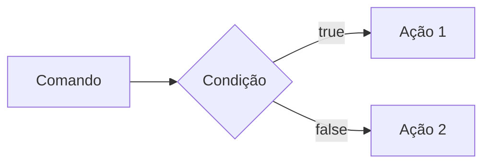
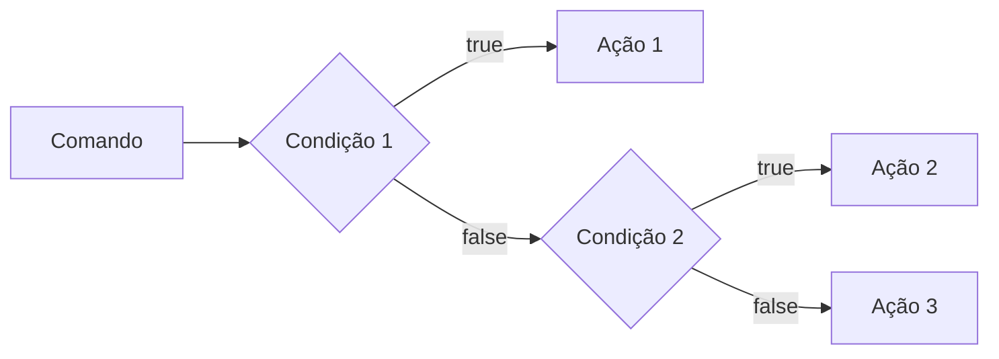
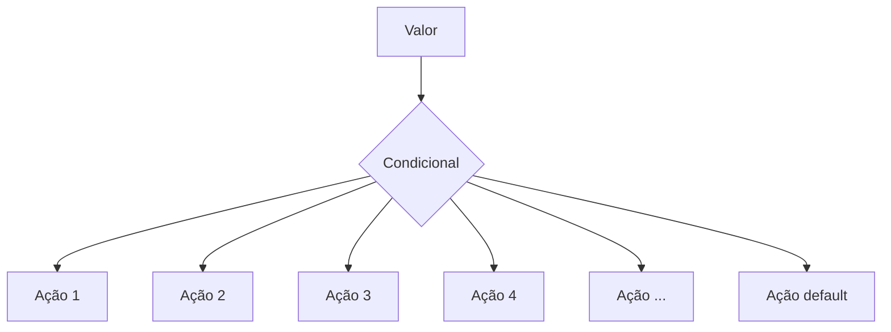

# Curso Backend - 225h - Tecnico em  
Sistemas - Senai

Profº Diogo TB

Escola SENAI Americana 
2º Semestre 2026

Aluna: Sofia Cristina

## Objetivos do curso

-Desenvolver aplicações Web Server Side, Utilizando a linguagem PHP:
- Aplicar Sisntaxe Nativa PP(Vanilla):
- Manipulação HTTP:
- Persistencia de dados:
- Segurança conta SQL Injection /CRSF;
- Refatoração em POO ( Programação Orientada ao Objeto);
- Arquitetura MVC (Model, View , Controller);
- Utilizaçãop do Framework Larevel;

# Observação 
Frameork - É um conjunto de Bibliotecas que oferecem uma solução completa para o desenvolvimento de alguma coisa

# Cronograma do Semestre 

Carga horária: 105h 1º Semestre e 120h 2º Semestre

Duração:  20 Semanas 1º Semestre e 20 Semanas 2º Semestre

### Semana 1: Introdução ao BackEnd e Configuração do Ambiente PHP

# O que é BackEnd ?
 - O backend é a parte de um sistema ou site que fica nos bastidores. 
 Ele cuida do servidor, do banco de dados e da lógica do sistema, processando as informações que o usuário não vê diretamente.
 
# Como o Backend Funciona 
  - Servidor: O computador central que recebe o que você pede na tela e envia a resposta de volta.
  - Banco de dados: Onde ficam guardadas as informações, como senhas, nomes de usuários e produtos.
  - Regras de negócio: A lógica que faz o sistema funcionar, como calcular o frete de uma compra ou conferir se a senha está certa.
 
 # Principais Tecnologias Linguagens de programação: 
 Ferramentas usadas para escrever o código do servidor, como Python, Node.js (JavaScript), Java e PHP.APIs: Os "caminhos" que permitem que o que você vê no celular converse com o servidor.

 # Sobre o mercado atual:
  o cenário é bom, mas mais exigente do que era. Quem conhece só o básico enfrenta mais concorrência. Quem alia backend sólido com IA aplicada, cloud e inglês está num patamar completamente diferente — vagas internacionais remotas são uma realidade pra esse perfil.

  # Para que serve
-Processar lógica de negócio: regras, cálculos, validações (ex: calcular frete, aplicar desconto, validar login)

-Gerenciar banco de dados: salvar, buscar, atualizar e deletar informações

-Autenticação e autorização: controlar quem pode acessar o quê (login, senhas, permissões)

-Fornecer APIs: criar "pontes" (endpoints) para o frontend ou outros sistemas consumirem dados

-Integração com serviços externos: pagamentos, e-mails, notificações, APIs de terceiros

-Segurança: proteger dados sensíveis, evitar ataques (SQL injection, XSS, etc.)

-Escalabilidade e performance: garantir que o sistema aguente muitos usuários ao mesmo tempo.

Fintechs e Bancos
Segurança, transações, alta escala 

E-commerce
Catálogo, pedidos, pagamentos

Healthtechs
Prontuários, telemedicina

SaaS / Startups
Backend é o coração do produto

Logística
Rastreio, rotas, tempo real

Educação
Plataformas, conteúdo, usuários

## O ciclo de vida da Requisisão http

#### O que é HTTTP ?

* HTTP*, Hyptext Trasnfer Ptotocol é um protocolo de comunicação utilizado para tranfrência de informação na www ( World Wide Web ) e em outas redes.

O HHTP é a base para que o cliente e um servidor web troquem insformações.Ele permite a requisição e a resposta de recursos como imagens, arquivos e textos 

### marmaid = Diagrama 
fica lindo alias 

---
### Aula 02 De Backend

## O que é Backednd
Backend é a interface entre o servidor e o usúario. Uma resposta para uma requisição.

#### Como funciona na prática o Backend ?

- ***Ação do usúario**: Envia uma solicitação pela UI(Inteface do Usuário). Exemplo de UI: Tela do celular, Navegador da Internet,Alexa. Gemini,IOT ...
- **Enviar uma requisição**: A UI Transforma a ação do usuário em uma requisição HTTP.
-**Processamento pelo Backend**: O código backend recebe o pedido valida os dados e decide o que fazer.Exemplo:Consultar uma informação no BD(A base de dados).
- **Resposta**: O servidor devolve o resultado para a UI. Exemplo: Um login autorizado, a confirmação de uma compra...
-----

### Tipos de Requisições HTTP:

Os tipos de requisições HTTP indicam a açãoque o usuário deseja executar no servidor. As principais ações são:
 
 - **GET**: Pede dados de um luhgar específico do servidor. "Não faz alterações no servidor"
 - ** DELETE**: Apaga um dado do servidor.
 - **post**: eLA ENVIA DADOS NOVOS PARA *criar* algo ou processar insformações no servidor.
 - **PUT/PATCH**: Modificar um dado já existente.

 >Obs: Diferença entre os comando : (Put) faz uma alteração completa já o PATCH faz uma alteração parcial.
----

### Iniciando o PHP

**PHP** (hyperTxt PreProcessor) é uma linguagem de programação interpretada e open source,focada no desenvolvimento de sistemas para web,pode ser usada junto com o HTML para criaçõa de páginas web dinâmicas.

O PHP de fato é uma das linguagens de programação mais populares da  atualidade. Ela permite que você crie aplicações web robustas, de uma muito simplificada e direta. A linguagem tem diversos recursos que facilitam e aceleram o processo de desenvolvimento de sites e sistemas para web. E além do mais, ela ainda tem um otímo ecosistema, uma excelente comunidade e um grande mercado de trabalho.

-----

##### Instalando o PHP

- Fazer o Dowload do php em (php.net)
- Zip - NTS(Non Thread Safe) 8.5
- Descompactar o arquivo do PHP na pasta C:\src\php (Para descompactar usar o 7zip + melhor ) => Nunca salvar arquivos ou programas na raiz do sistema(C:)
- Adicionar a Pasta do PHP(c:\src\php) As varaiáveis de ambiente do Sistema (PATH)
- Verificar a instalação com o comando *php--version*

----
### Aula do dia 07.08
#### Criando minha primeira Aplicação em PHP 

1. Antes de começar a codar:

- Prepara meu VS Code 
  - Criar um Profile próprio para o PHP
  - Instalar as extensões necessárias para transformar o VS Code em uma IDE
      - PHP Intelephense => Permite a utilização de snippets(atalhos de codígo)
      - PHP Debug => ajuda a encontrar erros de código
      - PHP Cs Fixer =>  formatação de códigos (Identação)
      - PHP Server => ajuda na criação de um servidor local para PHP
- Desabilitamos o PHP Nativo do VsCode ( @builtin PPHP)
    
2. Hello.World (muito importante)
 
 ### Semana 2 - Variáveis, Constantes e Operadores em PHP
 #### Estudo de Variáveis e constantes em PHP 
 Declarar variáveis é alocar um espaço na memoria que permite a inclusão e manipulação de dados 

 **Variáveis**

 - Devem ser declaradas usando "$" antes do nome da variável
 - São não tipadas ou seja não precisa declarar o tipo dela na criação .
 - Podem ser String, Numericas (Interger e Float), Bollenas e Nulas. Não permite declaração de Underfined
 - Usar o "declare(Strict_types+1)" na primeira linha do arquivo => blinda o sistema contra o conflito de tipos de variáveis.

 ###Constantes###

  - Não podem ser mudadas ou redeclaradas após a criação.
  - Podem ser criadas usando o "const" ou o "define"
  - Não permite interpolação 

  >concatenação = texto +texto( jeito errado)
  exemplo: 10 + 10 = 1010

  ## Estudo de Operadores" 
 
  **Aritméticos**: São usados para realizar Cálculos
  
  |Operador | Nome | Exemplo | Resultado |
  | - | - | - | - |
  | + | Adição | 10+5 | 15 |
  | - | Subtração | 10-5 | 5 |
  | * | Multiplicação | 10*5 | 50 |
  | / | Divisão | 10/5 | 2 |
  | % | Modulo(Resto) | 10%3 | 1 (10 div 3 da 3, sobra 1 ) |
  | ** | Expoente 2**3 | 8(2 elevado a 3) |

  obs: O operador % é o melhor amigo de um programador, permite ordenar listas e organizar fila e pilhas.

 **Relacionais**: Permite o Relacionamento entre dois valores, o resultado e uma operação é sempre uma boleana (verdadeira ou falsa). 

 | Operador | Significado | Exemplo | Resultado |
 | - | - | - | - |
 | > | Maior que | 18 > 18 | False |
 | >= | Maior ou igual que | 18 >= 18 | True |
 | < | Menor que | 10 < 20 | True |
 | <= | Menor ou igual á | 10 <=5 | False |
 | == | Comparação de valor | "10" == 10 | true |
 | === | Comparação Estrita | "10" ===10 | False |
 | != | Diferente | "10" !=10 | false
 | !== | Estritamente Diferente | "10"!==10 | True |

**Logícos**: Permite a Combinação entre sentença. 

- Operador AND (E) => && : Para o resultado ser o verdadeiro, todas as combinações precisam ser verdadeiras.
     - True && True => True 
     - True && False => False

- Operador OR (OU) => : Para o resultado ser o verdadeiro, basta apenas uma digitação ser verdadeira. 
    -  False || True => True
    - False || False => False

- Operador NOT (Não) => ! : Inverte a lógica da Operação 
    -!True => False
    - !false => true
   
    ---

    ### Aula do dia 12.08
    ### Semana 3 - Estrutura de Controle de Dados (condicionais e repetição)

 - **Conteúdo**: Estrutura `if`, `else`, `elseif`, operadores ternários, `match` => substituto do `switch/case`, loops `for`, `while`, `do-while` e `foreach`

 #### Estruturas de controlde de dados ajudam no processo de Automatização em Programas de Sistemas

 ##### Condicionais (IF, ELSE, ELSEIF)

 **Formas de uso**

 - Uso do 'If" apenas:
 Exemplo: Aplicar desconto de 10% em compras acima de 100 Reais;

 ```mermaid

 graph LR

    A[Comando] --> B{Condição} -->C[Ação]

```

```php

if($valorCompra > 100){
 $valorFinal = $valorCompra * 0.9;
}

```
- Uso do `if`e do  `else`
Exemplo: Aplicar um desconto de 10% para compras acima de 100reais e 5% para as demais compras



```php

if($valorCompra > 100){
    $valorFinal = $valorCompra * 0.9;
} else {
    $valorFinal = $valorCompra * 0.95;
}

```

## Aula do dia 14.08
- Uso do `elseif` (If Encadeado) => estrutura usada para manipulação de dados em duas ou mais condicionais.
Exemplo:Compras acima de 200 reias tem 15%de desconto, compras acima de 100 reias tem 10% de desconto e demais compras tem 5% desconto.



```php

if($valorCompra > 200 {
    $valorFinal = $valorCompra * 0.85;
} elseif($valorCompra > 100) {
    $valorFinal = $valorCompra * 0.9;
} else {
    $valorFinal = $valorCompra * 0.95;
}

```

*obs*: sempre usar `elseif` para situações que precisam de mais de uma condição, ou seja,fazer encadeamnto das condições.

- Uso *ERRADO* do if

```php 

if($valorCompra > 200) {
    $valorFinal = $valorCompra * 0.85;
}
if($valorCompra > 100) {
    $valorFinal = $valorCompra * 0.9;
} else {
    $valorFinal = $valorCompra * 0.95;
}

```
---

>Ele significa basicamente: "Se a primeira condição não for verdadeira, verifique esta outra condição."

>Pense nele como:
SE isso acontecer → faça isso
SENÃO SE aquilo acontecer → faça aquilo
SENÃO → faça outra coisa.

#### Operadores ternários 

Um atalho para a estrutura condicional `if/else, normalmente escrito em uma uníca linha de código.

` condição ? verdadeira : falsa ` 

Perfeito para a decisões curtas de uma linha de comando.

Exemplo: Verficar se a pessoa é maior de idade (18)

```php

$idade = 10;
//O fomrato é (condição) ? Verdadeiro : Falso;

$status = ($iddae>=18) ? "Maior de idade" : "menor de idade";
$status2 = ($idade>=60) ? "Idoso" : ($idade>=18) ? "Adulto" : "Criança" ;
'

echo $status //

```

#### Expressão Condicional `match` (PHP 8)

No mercado atual de PHP, não se uma mais uma `Switch/Case` para chegar valores fixos, usa-se o `match`. Ele compara um valor e retoran diretamente o resultado caso atenda a condição.



>Usamos o `graph TD` quando queremos fazer um gráfico de cima pra baixo. Igual mapa mental

#### Exemplo de aplicação: 
Selecionar o dia da semana a partir de um Nº

```php

$diaSemanaNum = date("W"); // pega o Dia da Semana em formato numérico

$nomeDiaSemana = match($diaSemanaNu) {
    "0" => "Domingo",
    "1" => "Segunda",
    "2" => "Terça",
    "3" => "Quarta",
    "4" => "Quinta",
    "5" => "Sexta",
    "6" => "Sábado",
    "default" => "Dia Inválido"
};

echo " Hoje é : $nomeDiaSemana";

```
